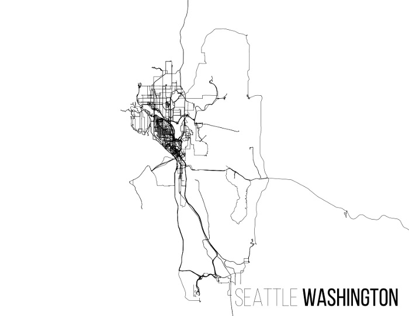

# gpx2ps

Visualize your GPS traces without any pesky maps getting in the way

## Overview

Given a directory full of `.gpx` files and a bounding box, `gpx2ps` will render them as a postscript file written to `STDOUT`.



## Usage

```
usage: gpx2ps.py [-h] [--replicate REPLICATE] [--inputdir INPUTDIR]
                 [--fgcolor FGCOLOR] [--bgcolor BGCOLOR]
                 [--autofit | --bbox MINLAT,MINLON,MAXLAT,MAXLON | --center LAT,LON | --tiles]
                 [--radius RADIUS] [--title TITLE] [--fontsize FONTSIZE]
                 [--thinfont THINFONT] [--boldfont BOLDFONT]
                 [--landscape | --portrait]

In goes the GPX, out goes the PS

optional arguments:
  -h, --help            show this help message and exit
  --replicate REPLICATE
                        Use settings stored in a previously generated .ps file
  --inputdir INPUTDIR   Directory that contains gpx files
  --fgcolor FGCOLOR     Foreground color in #RRGGBB format
  --bgcolor BGCOLOR     Background color in #RRGGBB format
  --autofit             Automatically crop output to fit data
  --bbox MINLAT,MINLON,MAXLAT,MAXLON
                        Crop output to fit within this bounding box
  --center LAT,LON      Center output on this point. Use with --radius
  --tiles               Render in tile mode, with one track per tile
  --radius RADIUS       Radius of area to include in output. Use with --center
  --title TITLE         Optional map title. Can be in the format 'Thin Text
                        [Bold Text]' for two sets of contrasting text weights
  --fontsize FONTSIZE   Font size in points
  --thinfont THINFONT   Postscript name of font to use for thin text. Default:
                        Helvetica-Light
  --boldfont BOLDFONT   Postscript name of font to use for bold text. Default:
                        Helvetica-Bold
  --landscape           Print in landscape mode. Default.
  --portrait            Print in portrait mode
```
